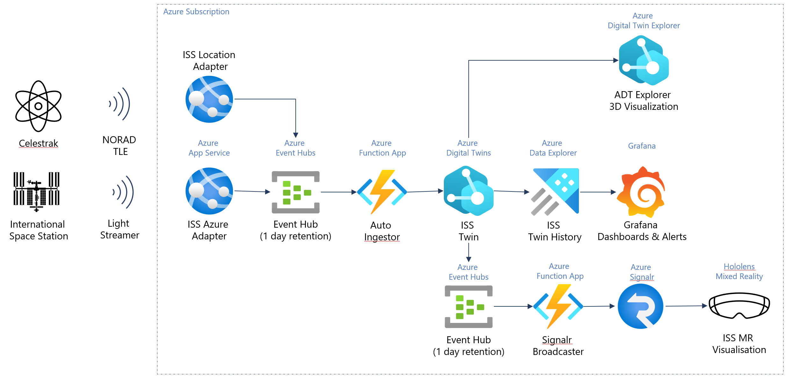
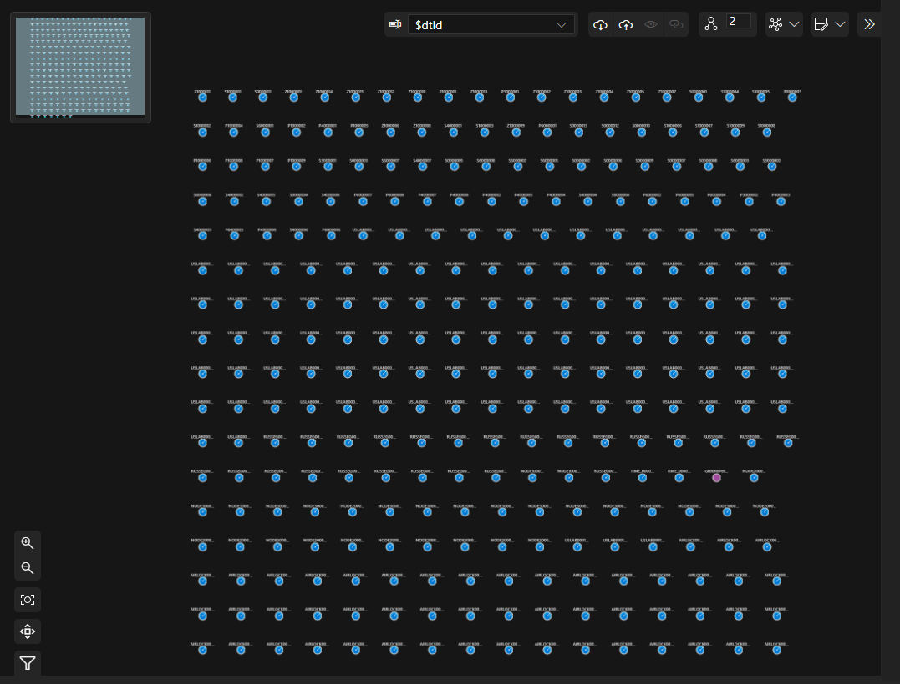
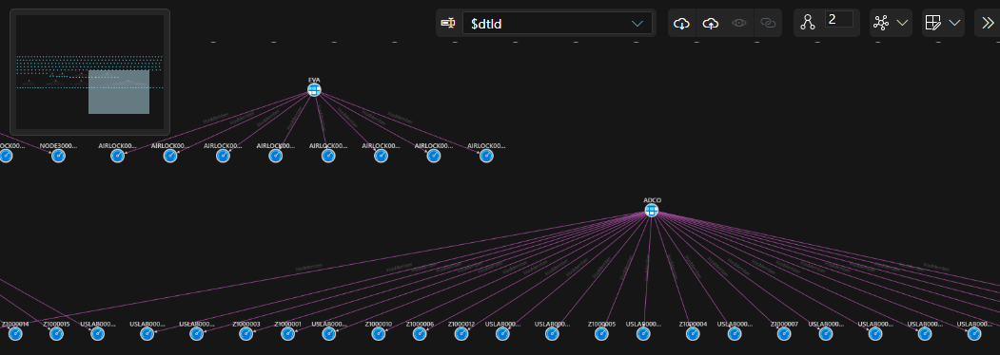

# Tracking the ISS with Azure Digital Twins

This directory contains all the scripts and code to track the [International Space Station](https://en.wikipedia.org/wiki/International_Space_Station) with Azure Digital Twins.

## Outstanding Tasks

- [x] Populate Graph Structure [here](./step-6-organize-iss-sensors.ps1)
- [x] Grafana Azure Active Directory Authentication [here](./step-2-configure-iss-dashboards.ps1)
- [ ] Useful Azure Digital Twins Queries
- [x] Add Hololens src into [iss-hololens](./iss-hololens) directory with [string replacable parameters] which can be replaced by the powershell.
- [ ] Add Option to deploy with IoT Hub ingestion rather than event hub ingestion

## Prerequisites

1. **Azure Subcription**

   You'll need an Azure subscription to complete this quickstart. If you don't have one already, [create one for free](https://azure.microsoft.com/free/) now.

2. **Azure Command Line Interface**

   You'll also need to make sure you have the latest Azure cli installed, you can do this [here](https://docs.microsoft.com/en-us/cli/azure/install-azure-cli?view=azure-cli-latest).

3. **Git Command Line Interface**
   
    You will also need to make sure you have git installed, you can do this following instructions [here](https://git-scm.com/book/en/v2/Getting-Started-Installing-Git).

4. **dotnet SDK**

    The Dotnet SDK is required to run this quickstart. You can install it [here](https://docs.microsoft.com/en-us/dotnet/core/tools/dotnet-install-script).

5. **Azure Function Core tools**

    Azure Function Core tools are also required to run this quickstart. You can install it [here](https://docs.microsoft.com/en-us/azure/azure-functions/functions-run-local?tabs=v4%2Cwindows%2Ccsharp%2Cportal%2Cbash).

6. **Bicep CLI**

    On top of this you then need to make sure you have Bicep cli installed by running the following command

        az bicep install

7. **Powershell**

    You will also need to make sure you have Powershell installed, you can do this [here](https://docs.microsoft.com/en-us/powershell/scripting/install/installing-powershell-core-on-windows?view=powershell-6).

## Getting started

Once you've got your Azure Suscription, and have the azure cli installed, you can start by running the following commands to setup the entire environment.
    
    az login

Then run the command below to create deploy the entire environment.

    ./iss-digitaltwins.ps1 <your-subscription-id> <location> <your-digitaltwins-name> <your-aad-login-domain e.g. https://login.microsoft.com>

The script above will do the following

1. Create a new Resource Group deploy Azure Resources
2. Configure Grafana Dashboards and connect it to the Azure Active Directory and Azure Data Explorer
3. Configure Azure Digital Twins Data History
4. Deploy All custom code for the applications
5. Configure the Hololens App to point at the deployed environment    
5. Generate Links for the applications

## The Architecture

Once the scripts (steps 1-5) are completed you should have the following architecture deployed in your Azure subscription.

## The code

There are four applications which are deployed (automatically above) in order for this to work.

- [iss adapter](https://github.com/WaywardHayward/iss_azure_data_adapter)
- [iss ground position adapter](https://github.com/WaywardHayward/iss-location-ingestor)
- [adt auto ingestor](https://github.com/WaywardHayward/adt-auto-ingestor)
- [adt signalr broadcaster](https://github.com/WaywardHayward/adt-signalr-broadcaster)

(after running the scripts to deploy the environment you should be able to find the code for the applications [here](./iss-applications/) )

## Setup the Digital Twin

Once your bicep is installed, this digital twin exploer should open with the your digital twin.

## Explore the Digital Twin

Navigate to the azure digital twin explorer for the ISS digital twin.

    https://explorer.digitaltwins.azure.net?eid=<your-digital-twin-host-name>&query=SELECT%20*%20From%20DigitalTwins

You will see that you have a number of sensor twins already configured (this should be the case if the ISS Telemetry stream is working).

At the moment there's not much graphical context to the sensors. This means the Dashboard called "Mission Control Panels" won't work as there's no Structure for you to browse through. 

So let's group the sensors by their discipline (Mission Control Callsigns) by running the following script 

    ./step-7-organize-iss-sensors.ps1 <your-digitaltwins-name> <your-resource-group-name>

>☕  this script takes a while to run - so you'll want to go and get a cup of tea or something).

This will create a new twin for each disicpline and add the sensors to those twins and should look something like this.

## Clean up

When you want to remove all the azure resources which this project setup simply run the following script

    ./step-10-teardown.ps1 <your-resource-group-name> iss.azure

This command will delete everything deployed by the bicep deployment you ran earlier.

