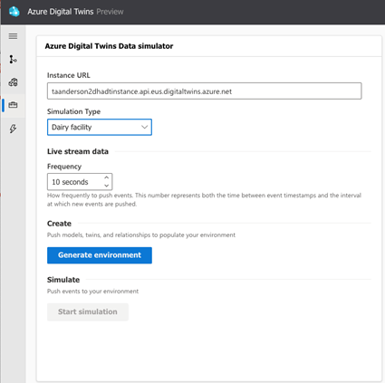
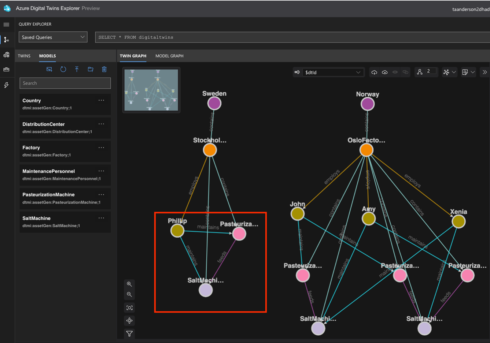

# Dairy scenario with data history (Azure Digital Twins query plugin for Azure Data Explorer)

This folder contains:

| File/folder | Description |
| --- | --- |
| *ContosoDairyDataHistoryGraphUpdatesQueries.kql* | Sample graph update queries reflecting a dairy operation, that can be run on Azure Data Explorer web UI. These queries can also be used in a larger solution that includes the Azure Digital Twins data history feature.  For walkthrough information and help running these queries in context, see [Create a data history connection for Azure Digital Twins](https://learn.microsoft.com/azure/digital-twins/how-to-create-data-history-connection) in the Azure Digital Twins documentation. |
| *ContosoDairyDataHistoryQueries.kql* | Sample queries reflecting a dairy operation, that can be run with the Azure Digital Twins query plugin for Azure Data Explorer. These queries can also be used in a larger solution that includes the Azure Digital Twins data history feature.  For walkthrough information and help running these queries in context, see [Create a data history connection for Azure Digital Twins](https://learn.microsoft.com/azure/digital-twins/how-to-create-data-history-connection) in the Azure Digital Twins documentation. |
| *Visualize_with_Grafana* | Contains a walkthrough document for creating dashboards with Azure Digital Twins, Azure Data Explorer, and Grafana. Also contains files for three sample dashboards. Based on the blog [Creating Dashboards with Azure Digital Twins, Azure Data Explorer, and Grafana](https://techcommunity.microsoft.com/t5/internet-of-things-blog/creating-dashboards-with-azure-digital-twins-azure-data-explorer/ba-p/3277879) |

## Graph updates walkthrough

This section is for use with the graph update queries in the *ContosoDairyDataHistoryGraphUpdatesQueries.kql* file.

This walkthrough assumes that you have set up data history connection that historizes twin property updates, twin lifecycle events, and relationship lifecycle events. Once you’ve set up data history, use the [Azure Digital Twins Data Simulator](https://learn.microsoft.com/azure/digital-twins/how-to-use-data-history#create-a-sample-graph) to automatically provision a twin graph of a dairy operation in your Azure Digital Twins instance. Be sure to select the **Dairy Facility** simulation type when generating the twin graph. Twin and relationship creation events will be generated and historized to your Azure Data Explorer database by this step.

Open [Azure Digital Twins Explorer](https://learn.microsoft.com/azure/digital-twins/how-to-use-azure-digital-twins-explorer) and run the query _SELECT * FROM digitaltwins_ to visualize the twin graph. Make a note of the time, then wait a few minutes to establish an interval before you modify the twin graph. Then, delete several twins as shown in the red box in the figure below, by right-clicking on the twins and selecting **Delete twin(s)**. This will create twin/relationship deletion events.  

Open the [Azure Data Explorer web UI](https://learn.microsoft.com/azure/data-explorer/web-query-data), and click on the database that you selected when you created the data history connection.

Run the example KQL queries from the file *ContosoDairyDataHistoryGraphUpdatesQueries.kql* located in this GitHub folder.
