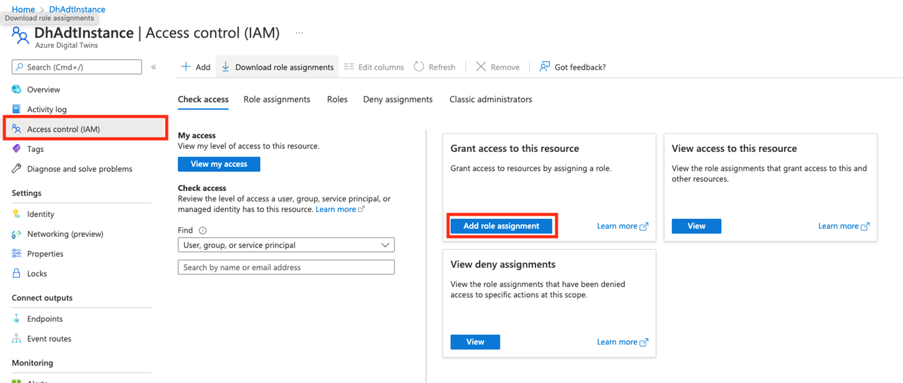
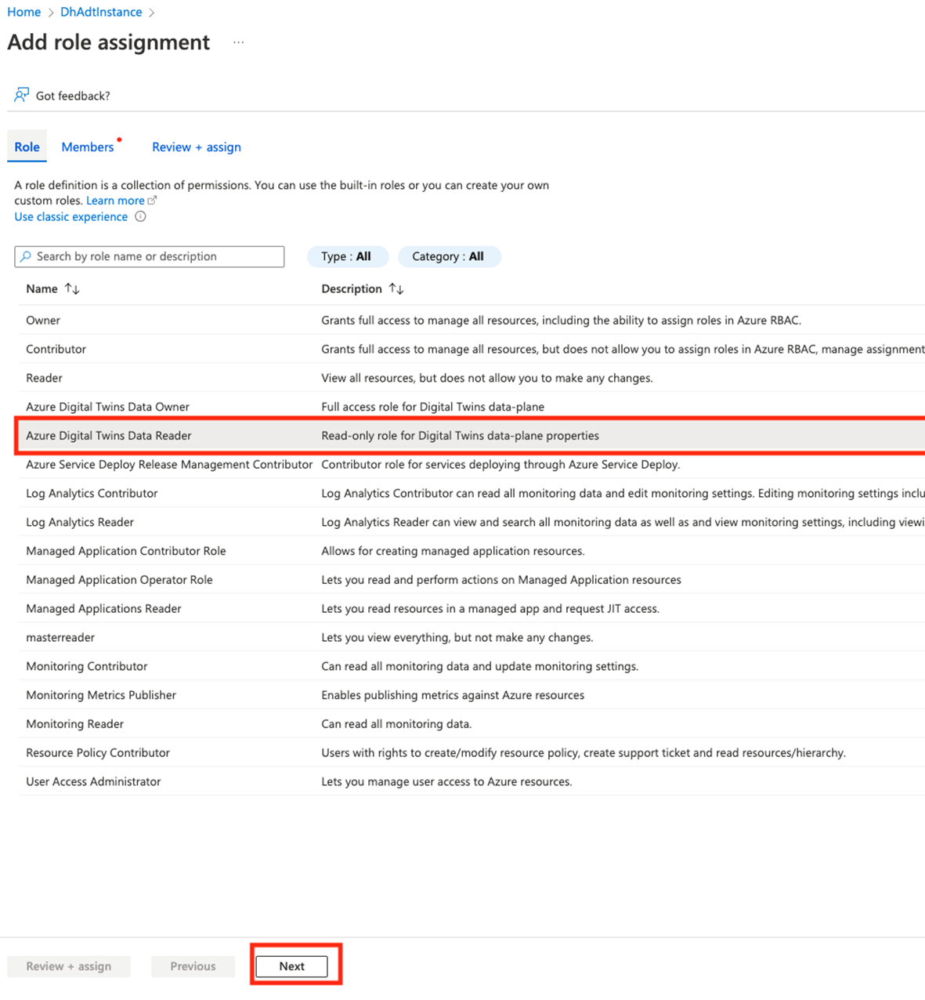
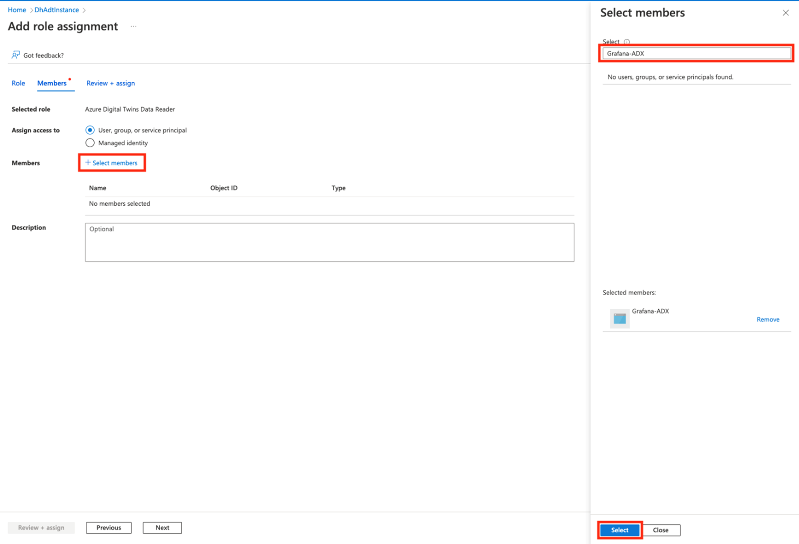
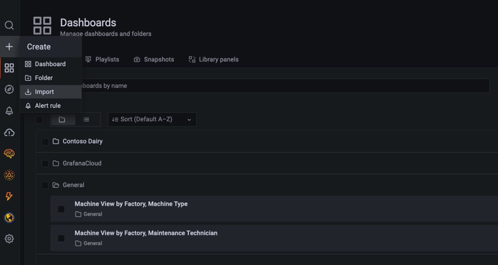
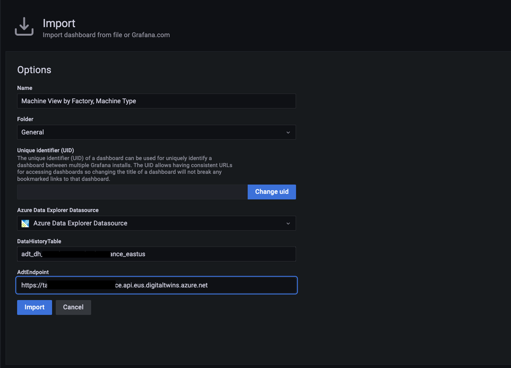
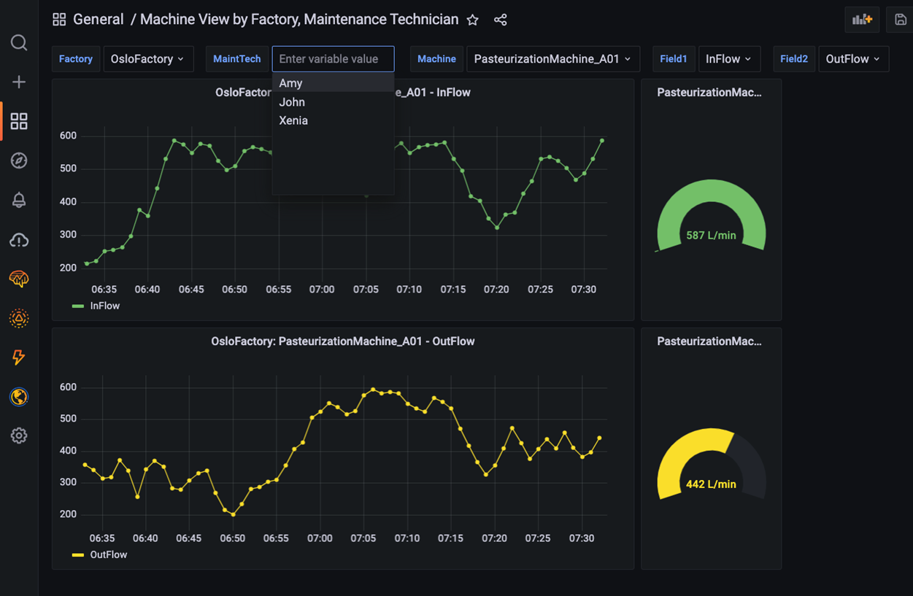
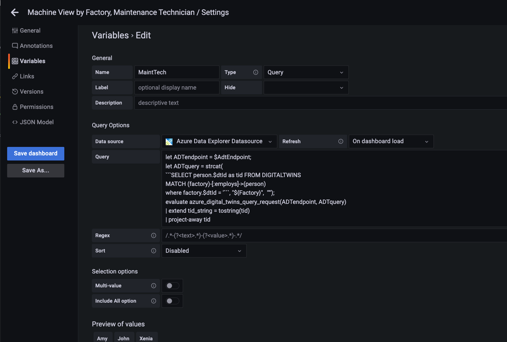
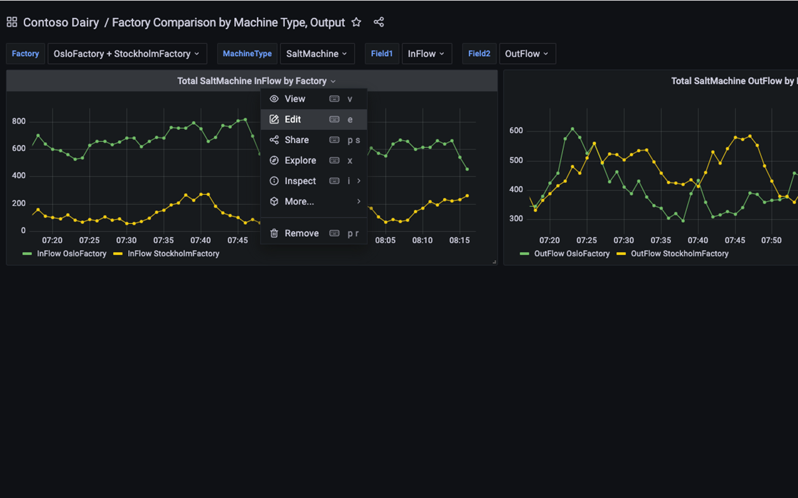
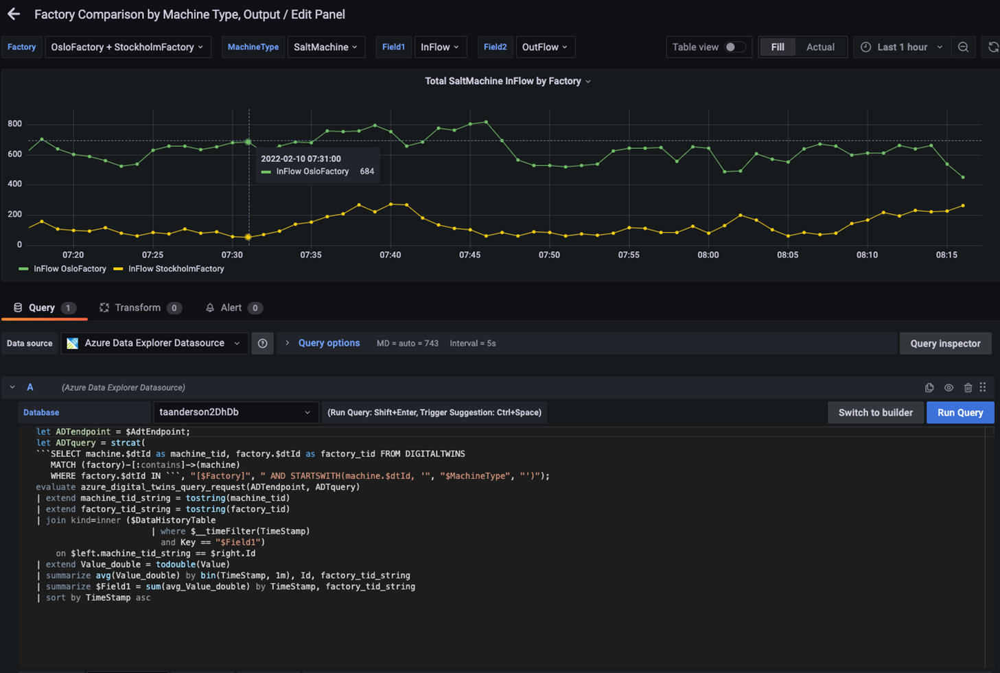
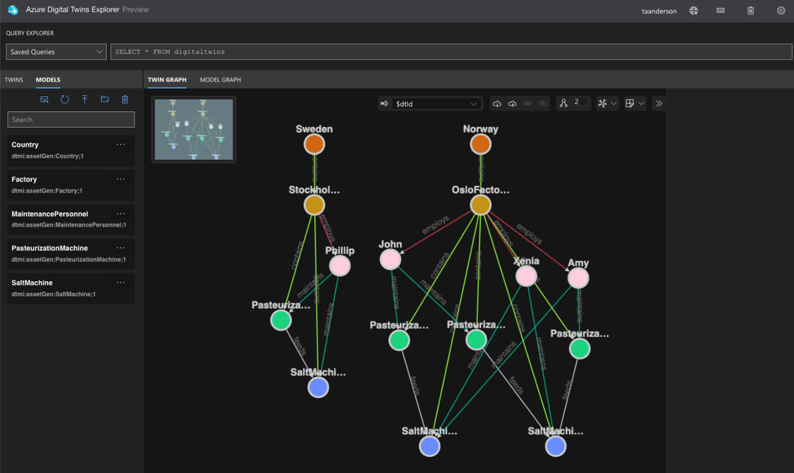

# Creating dashboards with Azure Digital Twins, Azure Data Explorer, and Grafana 

This article shows how to create dashboards to visualize the performance of the dairy operation example in [Use data history with Azure Data Explorer](https://docs.microsoft.com/azure/digital-twins/how-to-use-data-history). The dashboards feature dropdown menus, charts, gauges, and other elements that allow end users to inspect the behavior of various digital twins. Dropdown menu selections drive dynamic queries that query the twin graph based on twin type, twin name, and twin relationships. You can use these examples to build dashboards for your own Azure Digital Twins environments.

## Prerequisites

* Complete the [Use data history with Azure Data Explorer](https://docs.microsoft.com/azure/digital-twins/how-to-use-data-history) exercise
* Gain access to your own [Grafana](https://grafana.com/grafana/) resource

## Connect Grafana to an Azure Data Explorer data source 

The data history feature for Azure Digital Twins historizes twin changes to an Azure Data Explorer database.  You can connect this database to Grafana by following the steps in [Visualize data from Azure Data Explorer in Grafana](https://docs.microsoft.com/azure/data-explorer/grafana) (the video included in the guide is a great place to start). When installing the Azure Data Explorer plugin, make sure that the plugin is version 3.6.1 or higher.

## Assign your app registration the Azure Digital Twins Data Reader role

In the above step, you will create an app registration.  Assign this app registration the *Azure Digital Twins Data Reader* role on your Azure Digital Twins instance. This will enable the KQL queries run by the dashboards to query your Azure Digital Twins instance.

Start by viewing your Azure Digital Twins instance in the portal. Select **Access Control (IAM)** from the left navigation and select **Add role assignment**.

In the next screen, select the **Azure Digital Twins Data Reader** role, and select **Next**.

In the next screen, choose **+Select** members. Search for the name of your app registration and choose **Select**.  

On the next screen, select **Review + assign**.

## Import the Contoso Dairy dashboards into Grafana

Three dashboard JSON files are provided in this repo folder. Download the files. Import the *Machine View by Factory, Maintenance Technician* dashboard into Grafana.

In the import dialog, select the Azure Data Explorer data source you created earlier and enter values for your Azure Digital Twins endpoint and data history table.

Once a dashboard loads, you will see time series charts and gauges for machines in the dairy operation. You can make selections from the dropdown menus at the top to drill down on the machines of interest.

When you select an item from the menu, it triggers a query to the twin graph of the dairy operation that searches for twins based on twin name, twin type, relationships between twins, and other parameters. The result of the query is held in a Grafana variable. To view variables, click on the gear icon in the upper right-hand corner of a dashboard, then click on **Variables** in the left navigation panel.

The KQL queries for most variables dynamically assemble an Azure Digital Twins query via the `strcat()` KQL function. In many cases, the assembled Azure Digital Twins query references other Grafana variables from other menus. Grafana denotes variables in a query expression with a `$`. For example, the **MaintTech** variable is based on a query that searches for all twins that have an *employs* relationship with a factory twin, where the factory twin ID is defined by the **Factory** variable. The result of the query is held in the **MaintTech** Grafana variable.  

You can also view the KQL queries that fetch data for a panel. Click on **Edit** to view the panel query.

In the editor, you can view the query for each tile that uses Grafana variables. These variables are driven by the menu queries discussed above. 

In this walkthrough, you learned how to use Azure Digital Twins to contextualize time series data and how to use Grafana to support visualization experiences. The relationships in the twin graph (shown below) can be used to support a wide array of analytics and views of time series data. This includes summing the output of machines that feed a common downstream machine, or comparing the performance of similar machines in the same factory, or comparing machines in different factories. You can use [the dairy example queries in this repo](../ContosoDairyDataHistoryQueries.kql) to get started with your own analytics and visualizations.

