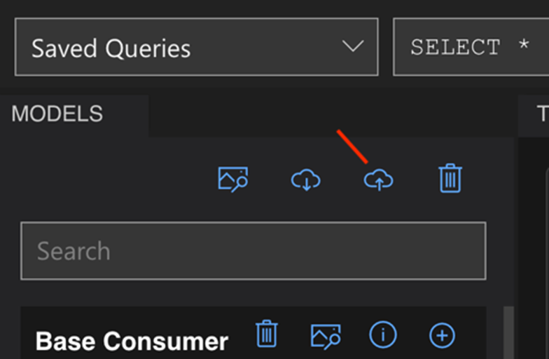
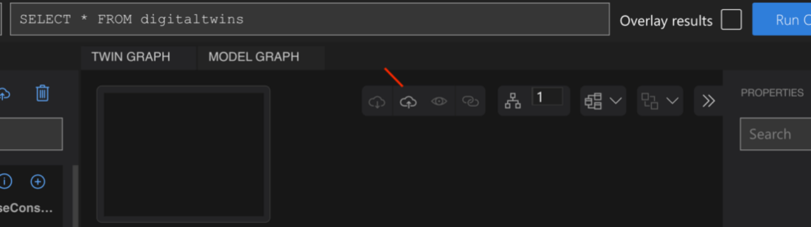
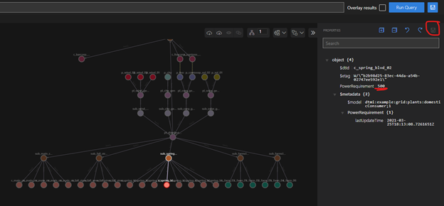
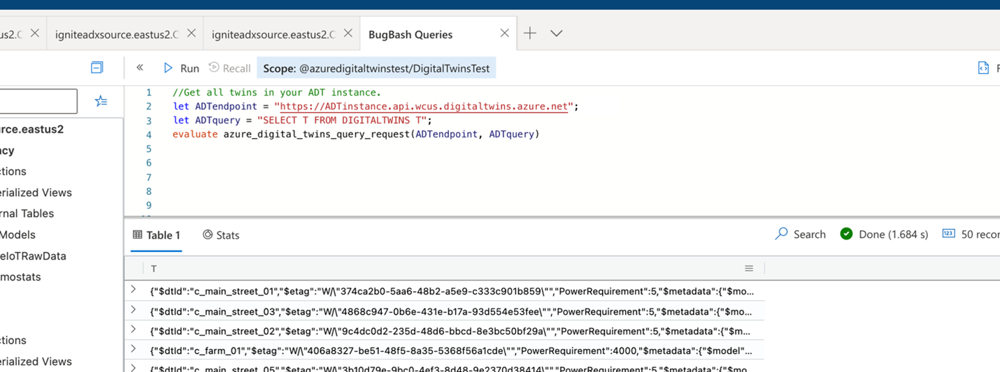
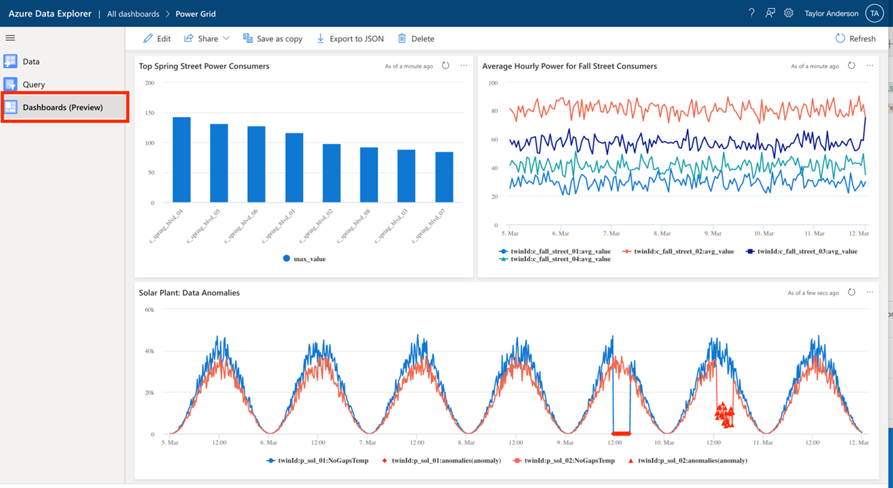

# Azure Digital Twins query plugin for ADX: Sample queries and walkthrough

This folder contains sample queries that can be run with the Azure Digital Twins query plugin for Azure Data Explorer. This README contains a walkthrough for how to run the sample queries using the sample data in this repository.

To get you up and running with the plugin, these instructions provide an example scenario where you will combine data in a sample twin graph in Azure Digital Twins with sample time series data in Azure Data Explorer. More specifically, you will use the queries to understand the operational behavior of various portions of an example power distribution grid. You are also welcome to use the plugin with your own application (be sure to run the .enable Kusto command first, read more [here](https://docs.microsoft.com/en-us/azure/digital-twins/concepts-data-explorer-plugin)).  

## Step 1: Create a twin graph using Azure Digital Twins Explorer

1. Create an Azure Digital Twins instance using the CLI commands below or via the Azure portal. Copy the instance's URL once it is online.

    ```
    az account set --subscription <your-subscription-ID>
    az dt create -n <instance-name> -g <resource-group> 
    ```

    **Note: Ensure the resource group exists.**
  
1. Grant yourself the **Azure Digital Twins Data Owner** role on the instance. It may take up to five minutes for this RBAC change to apply.
  
    ```
    az dt role-assignment create -n <instance-name> --assignee "<owneruser@microsoft.com>" --role "Azure Digital Twins Data Owner" 
    ``` 

1. Download the sample models and graph from the [energy-grid-example](../models/energy-grid-example) folder to your local computer. You can do this by cloning this repository or downloading it as a ZIP, and then navigating to the energy-grid-example folder on your machine.

1. Open [Azure Digital Twins Explorer](https://explorer.digitaltwins.azure.net/). It should prompt you to enter your Azure Digital Twins instance URL. If not, click on the globe icon in the top right corner.

1. Enter your Azure Digital Twins instance URL (endpoint must start with 'https://').

1. On the left pane, click on the **Upload a Model** button (cloud icon with upward arrow).

    

    1. Go to the folder where you downloaded the repository. Navigate into *<folder>/model/energy-grid-example*.

    1. Select all the JSON files (models) and upload them.

1. In the middle pane, click the **Import Graph** button (also a cloud icon with upward arrow).

    

    1. Within *<folder>/model/energy-grid-example*, select **distributionGrid.xlsx** to import it.

1. You should see a graph preview. Click on the floppy disk icon to finish importing the graph (this creates twins and relationships).

1. Navigate back to the Twin Graph tab. In the query section, type in "SELECT * FROM DIGITALTWINS" and select Run Query. You should see the graph displayed in the Twin Graph window.

1. Click on one of the leaf nodes that has this model: `dtmi:example:grid:plants:domesticConsumer;1`.

1. Update the PowerRequirement value to 500 and save it (using the disc button circled in red below) to patch the twin.

    

## Step 2: Run joint Azure Digital Twins/ADX queries

1. [Connect to the Samples database](https://dataexplorer.azure.com/clusters/help/databases/Samples) on the public ADX help cluster. The database features the table **SamplePowerRequirementHistorizedData** that contains historized property values over a one month period for selected digital twins in the graph.

1. The list of example queries is found in the [sample-queries.kusto](sample-queries.kusto) file. Copy and paste each query below into ADX to run it.

1. To run a query in ADX, click on the query to highlight it and press the Run button.

    

Want even more fun? Build an ADX dashboard with charts from your new Azure Digital Twins/ADX queries! ADX also offers integrations with third party visualization packages such as [Power BI](https://docs.microsoft.com/azure/data-explorer/power-bi-best-practices), Grafana, Tableau and others.



## Step 3: Delete all resources

When you're finished, follow these steps to delete the resources used in this walkthrough.

1. Delete your Azure Digital Twins instance using the following CLI command. This will also delete the twins and models associated with the instance.

    ```
    az dt delete -n <instance-name>
    ```

1. Remove the cloned or downloaded repository from your machine.
