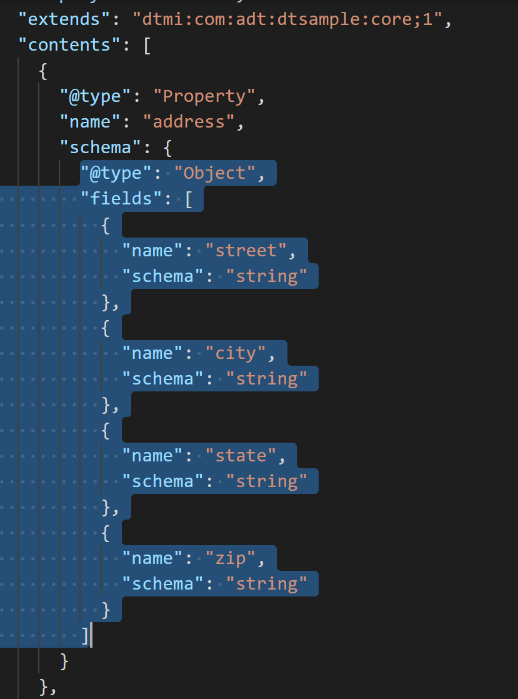
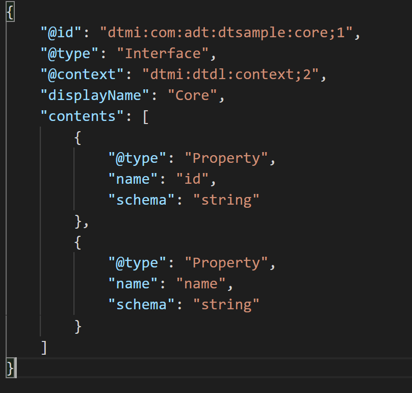
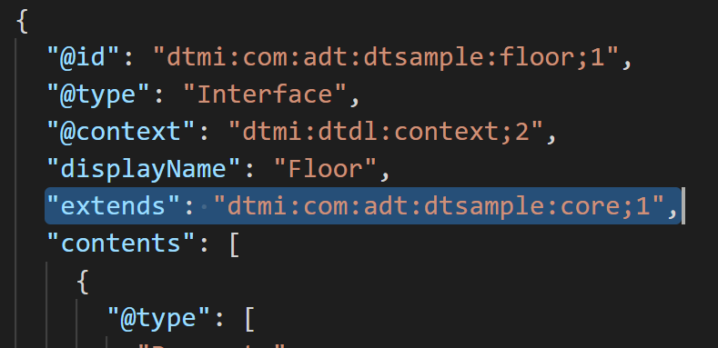
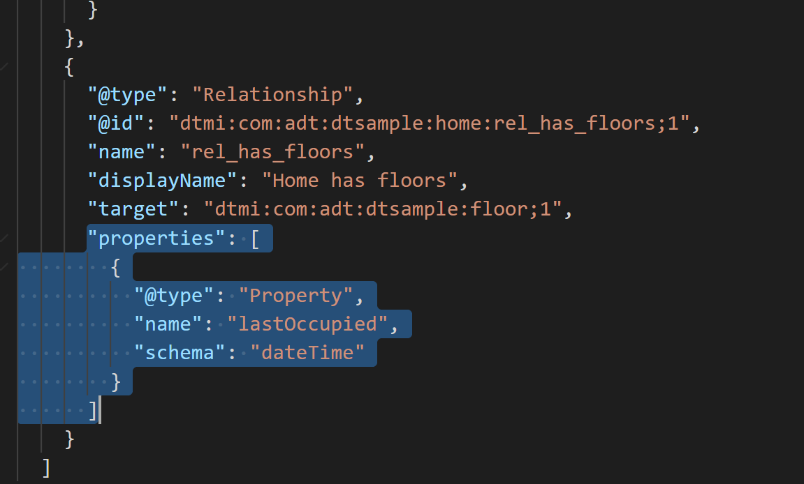
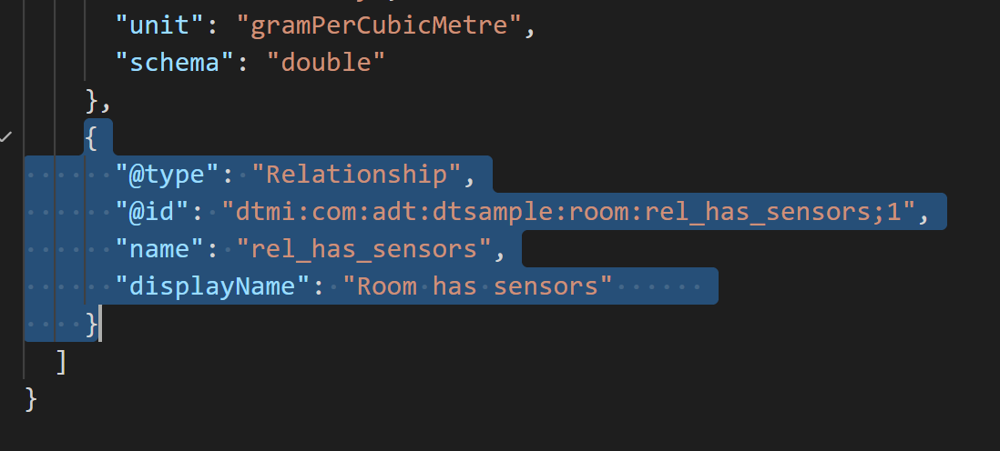

# Changes made between basic and advanced

- [Semantic Types](#semantic-types)
- [Complex Types (Object)](#complex-type)
- [Inheritance](#inheritance)
- [Relationship properties](#relationship-properties)
- [Non-targeted relationship](#non-targeted-relationship)

## Semantic Types

In the `Sensor` model, both the Humidity property and Temperature telemetry are semantic type (from basic double).

The same is true for the `Room` model's Humidity property.

## Complex Type

Added a new address complex type to collect address information on the `Home` model.

## Inheritance

Added the ICore.json to include an id and name.

The `dtmi:com:adt:dtsample:core;1` is extended by the `Home`, `Floor`, and `Room` models.

## Relationship Properties

Relationship `dtmi:com:adt:dtsample:home:rel_has_floors;1` on the `Home` model has a newly added property.

## Non-Targeted Relationship

Removed the target property on the `dtmi:com:adt:dtsample:room:rel_has_sensors;1` on the `Room` model.

