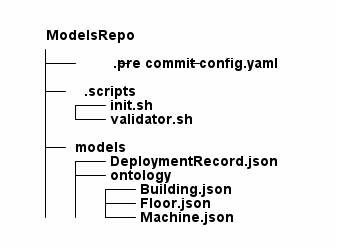
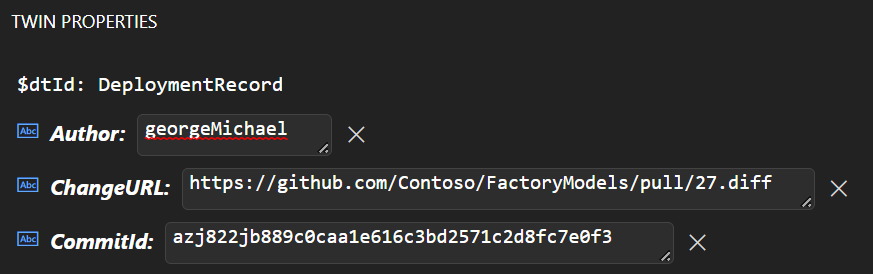
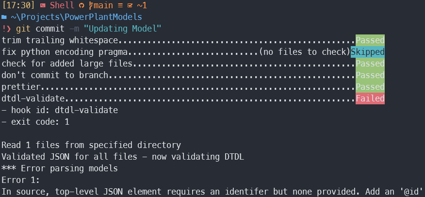

# Table of Contents

1.  [Introduction](#org96b5ea3)
2.  [Pre-Commit](#orgaba53a1)
    1.  [Setup](#org670901f)
        1.  [Prequisites](#orgac15989)
        2.  [Repository Setup](#org0486423)
3.  [Power Automate Flow](#org28a1352)
    1.  [Importing the Flow](#orge1d12d9)

# Introduction

This example demonstrates an automated process that can be used to upload DTDL models from a GitHub repo to Azure Digital Twins, upon the successful completion of a pull request. Additionally, this sample will also demonstrate how to use pre-commit to ensure that the models contained GitHub repository adhere to valid DTDL syntax.

Note that there are three strategies for updating models in Azure Digital Twins. This example follows follows strategy 3. Should you decide to follow any other strategy, you can modify the below example as needed:

-   Strategy 1: Upload new model version, then update digital twins referencing previous model version
-   Strategy 2: Delete current model, then upload new model with the same model ID.
-   Strategy 3: Delete entire model ontology and reupload all models with every change.

**Note:** This writeup assumes the following:

-   You have the **Owner** role for the Azure Digital Twins instance you are using (for assigning roles).
-   Your instance has a **system managed identity** assigned to it.
-   You have ownership over the GitHub repository that you will be using.

# Pre-Commit

The inclusion of a linter that validates DTDL syntax for models contained in a GitHub repository is essential for preventing defect leakage along with reducing the workload Power Automate Flow has to carry out, as such checks would not have to be performed during the flow execution. Such functionality can be achieved using **pre-commit** in combination with the DTDL Validator.

For more information on **pre-commit** visit the offical [documentation](https://pre-commit.com/).

## Setup

### Prequisites

-   Install [**Python**](https://www.python.org/downloads/) >= 3.10
-   Install [**.NET core**](https://dotnet.microsoft.com/en-us/download) >= 3.1

### Repository Setup

Pictured below is a diagram outlining what the directory structure for the repository should look like:

Take note of the `DeploymentRecord.json` file in this structure. This model is essential for keeping track of changes made to the ontology whenever a pull request is merged. Below is an example of what this model could look like:

    {
      "@context": "dtmi:dtdl:context;2",
      "@id": "dtmi:deployment:DeploymentRecord;1",
      "@type": "Interface",
      "displayName": "Git Deployment Record",
      "contents": [
        {
          "@type": "Property",
          "name": "Author",
          "schema": "string"
        },
        {
          "@type": "Property",
          "name": "CommitId",
          "schema": "string"
        },
        {
          "@type": "Property",
          "name": "ChangeURL",
          "schema": "string"
        }
      ]
    }

In order for **pre-commit** to work, hooks need to get added in `.git/hooks`. However, hooks are ignored by the source control system. This is why the inclusion of `./.scripts/.init.sh` is necessary:

    echo "Installing dependencies for pre-commit."
    
    pip install pre-commit
    
    pre-commit install
    
    echo "Finished configuring pre-commit hooks."

Verify that `.git/hooks/pre-commit` has been added. At which point, additional hooks can easily be added and configured in `./.pre-commit-config.yaml` Below is an example config file that includes the a validator for DTDL syntax.

    repos:
      - repo: local
        hooks:
          - id: dtdl-validator
            name: dtdl-validator
            files: ".json"
            language: script
            entry: ./.scripts/validate.sh

Follow the steps to include the DTDL validator as a [global tool.](https://github.com/Azure-Samples/DTDL-Validator)
Once complete, ensure that `.scripts/validator.sh` contains the following:

    #!/usr/bin/env sh
    set -e
    
    if dtdl-validator --files "$@"; then
        echo "Validation Success"
    else
        exit 1
    fi

Now whenever an attempt is made to push code upstream, the validator will run and prevent invalid DTDL modesl from being pushed.

# Power Automate Flow

Power Automate has first class GitHub and DigitalTwins connectors that empower users by enabling them to manage an ontology using an automated process. For more information explaining ontologies and their benefits [visit](https://learn.microsoft.com/en-us/azure/digital-twins/concepts-ontologies).

In this example, the steps involved when the flow get triggered are as follows:

## Importing the Flow

To begin, navigate to the **My flows** tab in Power Automate and select the **Import Package** option.

Select the **Upload** button and select the ZIP file included in this sample.

Authenticate the connectors in this sample by choosing **Select during import** in the **Review Package Content** for each of the resources listed.

Next, select Import and navigate to your newly added flow.

Lastly, trigger the flow by closing the PR associated with the new model version you commited. You can use the [Azure Digital Twins Explorer](https://explorer.digitaltwins.azure.net/) to inspect the updated model version of a twin.

