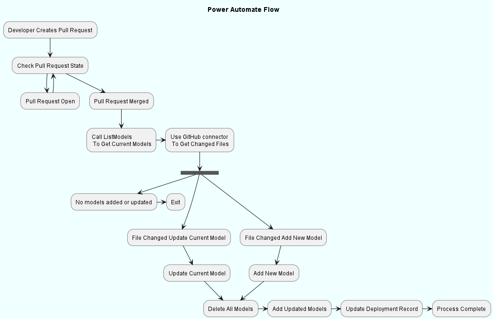

# Table of Contents

1.  [Introduction](#orgfafc9b0)
2.  [GitHub Setup](#orgef2fe15)
    1.  [Authenticating GitHub Repository](#org23c1a61)
    2.  [Actions Workflow](#org21d06c5)
3.  [Power Automate Flow](#orgc1d2132)

# Introduction

This example demonstrates two automated processes. The first processs uploads DTDL models from a GitHub repo to Azure Digital Twins. The second process updates any digital twins that reference the previous model version to the new model version. The first process is automated via GitHub actions, while the second process is automated through a Power Automate flow.

Note that there are two strategies for updating models in Azure Digital Twins. This example follows follows strategy 1. Should you decide to follow strategy 2, you can modify the below example as needed:

-   Strategy 1: Upload new model version, then update digital twins referencing previous model version
-   Strategy 2: Delete current model, then upload new model with the same model id.

This writeup assumes the following:

-   You have the **Owner** role for the Azure Digital Twins instance you are using (for assigning roles).
-   Your instance has a **system managed identity** assigned to it.
-   You have ownership over the GitHub repository that you will be using.

# GitHub Setup

This section configures the authentication needed for your GitHub repository and defines a GitHub action that uploads models to Azure Digital Twins upon a commit.

## Authenticating GitHub Repository

First create an [Azure AD application](https://learn.microsoft.com/en-us/azure/active-directory/develop/howto-create-service-principal-portal) and assign the **Azure Digital Twins Owner Role** to the newly registered AD application.

Next, generate federated credentials that your GitHub repository will use. To do this, naviagate to the AD application your registered in the **Azure Portal** and click on the **Certificates & Secrets** tab on the left.

Click on the **Federated credentials** tab and select **Add credential**.

Select **Github Actions deploying Azure resources**

Now fill out the following fields:

<table border="2" cellspacing="0" cellpadding="6" rules="groups" frame="hsides">

<colgroup>
<col  class="org-left" />

<col  class="org-left" />

<col  class="org-left" />
</colgroup>
<thead>
<tr>
<th scope="col" class="org-left">Field</th>
<th scope="col" class="org-left">Description</th>
<th scope="col" class="org-left">Example</th>
</tr>
</thead>

<tbody>
<tr>
<td class="org-left">Organization</td>
<td class="org-left">Your GitHub organization anme or GitHub username.</td>
<td class="org-left"><b>contoso</b></td>
</tr>

<tr>
<td class="org-left">Repository</td>
<td class="org-left">Your repository name.</td>
<td class="org-left"><b>contoso-models</b></td>
</tr>

<tr>
<td class="org-left">Entity Type</td>
<td class="org-left">The filter used to scope the OIDC requests from GitHub workflows. In our case, we&rsquo;ve set it filter based on our main branches</td>
<td class="org-left"><b>Environment</b>, <b>Branch</b>, <b>Pull Request</b>, <b>Tag</b></td>
</tr>
</tbody>
</table>

Lastly retrieve the following values from your Azure AD application and add them as secrets to your GitHub repository:

<table border="2" cellspacing="0" cellpadding="6" rules="groups" frame="hsides">

<colgroup>
<col  class="org-left" />

<col  class="org-left" />
</colgroup>
<thead>
<tr>
<th scope="col" class="org-left">GitHub Secret</th>
<th scope="col" class="org-left">Value from Azure AD Application</th>
</tr>
</thead>

<tbody>
<tr>
<td class="org-left">AZURE_CLIENT_ID</td>
<td class="org-left">Application (client) ID</td>
</tr>
</tbody>

<tbody>
<tr>
<td class="org-left">AZURE_TENANT_ID</td>
<td class="org-left">Directory (tenant) ID</td>
</tr>
</tbody>

<tbody>
<tr>
<td class="org-left">AZURE_SUBSCRIPTION_ID</td>
<td class="org-left">Subscription ID</td>
</tr>
</tbody>

<tbody>
<tr>
<td class="org-left">AZURE_URL</td>
<td class="org-left">The endpoint for your Digital Twins instance</td>
</tr>
</tbody>
</table>

Additional Resources:

-   [Use the portal to create an Azure AD Applicaiton](https://learn.microsoft.com/en-us/azure/active-directory/develop/howto-create-service-principal-portal)
-   [Use GitHub Actions to connect to Azure](https://learn.microsoft.com/en-us/azure/active-directory/develop/howto-create-service-principal-portal)

## Actions Workflow

In order to setup GitHub Actions you need to first create **YAML** file in the **.github/workflows** path of your repository that defines the workflow.

    name: CI
    on:
      push:
        branches: [ "main" ]                                                  # Action triggered on push to main branch
      # pull_request:
        # branches: [ "main" ]
      # workflow_dispatch:
      # Allows you to run this workflow manually from the Actions tab​
    
    permissions:
      id-token: write
      contents: read
    
    jobs:
      build:
        runs-on: ubuntu-latest
        steps
          - uses: actions/checkout@v3                                         # Checks out repository content​
    
          - name: AZ Login                                                    # Logins in to Azure CLI using secrets that are managed by GitHub
            uses: azure/login@v1
            with:
              client-id: ${{ secrets.AZURE_CLIENT_ID }}
              tenant-id: ${{ secrets.AZURE_TENANT_ID }}
              subscription-id: ${{ secrets.AZURE_SUBSCRIPTION_ID }}
    
          - name: Changed Files                                               # Stores changed files in a variable that can be referenced in later steps.
            id: changed_files
            uses: tj-actions/changed-files@v32.1.2
            with:
              separator: " "
    
          - name: Setup Python Environment                                    # We're using a Python script to upload models. If using a different language different steps would be required to
            uses: actions/setup-python@v4.3.0                                 # Setup execution environment
            with:
              python-version: 3.11.0-rc.2
    
          - name: Install dependencies
            run: |
              python -m pip install --upgrade pip
              python -m pip install -r ./.pipeline/UploadModels/requirements.txt
    
          - name: Run Script to Upload Models                                 # Executes script that uploads models.
            run: |
              python ./.pipeline/UploadModels/main.py ${{ secrets.AZURE_URL }} ${{ steps.changed_files.outputs.all_changed_files }}

For more information on GitHub Actions, visit the official [documentation.](https://docs.github.com/en/actions)

The script that gets executed can be found [here](./PowerPlantModels/.pipeline/UploadModels/main.py).

# Power Automate Flow

Below is a diagram of the flow, which is triggered then the PR for the model commit is closed in GitHub.

To begin, navigate to the **My Flows** tab in Power Automate and click on **Import Package** option.

Click on the **Upload** button and select the ZIP file included in this sample.

Authenticate the connectors in this sample by clicking on **Select during import** in the **Review Package Content** for each of the resources listed.

Next, click Import and go to your newly added flow.

Lastly, trigger the flow by closing the PR associated with the new model version you commited. You can use the ADT Explorer to inspect the updated model version of a twin.

